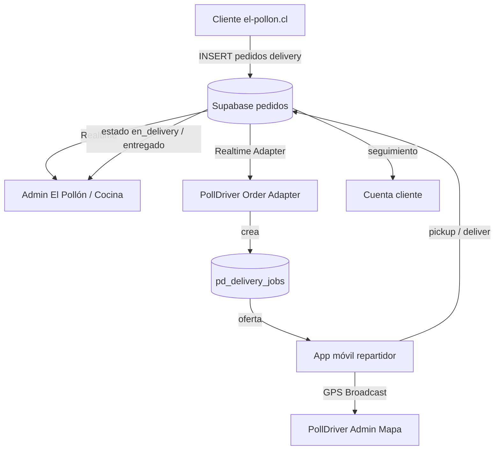

# PollDriver — Plan de implementación

**Versión:** 1.0  
**Fecha:** 2026-07-23  
**Estado:** Fase 0 completada → Fase 1 en curso  
**Regla de oro:** PollDriver **extiende** El Pollón. No lo reemplaza.

---

## 1. Estado actual de El Pollón (verificado en código)

| Ítem | Valor real |
|------|------------|
| Carpeta | `APP POLLON/el-pollon` |
| Stack | React 19 + Vite + Tailwind + React Router (SPA, **no Next.js**) |
| Backend | Supabase Auth + PostgreSQL + Realtime + Storage |
| Dominios | https://el-pollon.cl · https://app-pollon.vercel.app |
| Pedidos | Tabla `public.pedidos` |
| Sucursales | Tabla `public.branches` |
| Usuarios | Tabla `public.profiles` (`role`, `branch_id`) |
| Historial estados | `public.order_status_history` (trigger) |
| Realtime admin | Canal `postgres_changes` sobre `pedidos` (`orderService` / `useOrders`) |

### Flujo de estados (oficial, no inventar otros)

```text
pendiente → confirmado → preparando → en_delivery → entregado
(+ cancelado terminal; legacy: listo → en_delivery)
```

### Tipos de pedido

`delivery` | `retiro` | `reserva`  
**Solo `delivery` entra a PollDriver.**

### Roles existentes

`super_admin` · `admin_sucursal` · `cajera` · `cocina` · **`delivery`** · `cliente`

> El rol `delivery` ya existe pero hoy solo abre `/admin/pedidos`. PollDriver lo convierte en app móvil real.

### Gaps actuales para despacho

- No hay `assigned_driver_id` / jobs de entrega  
- No hay GPS / mapa de repartidores  
- No hay ofertas push ni capacidad 2 pedidos  
- `delivery_cost` es TEXT informativo; checkout no calcula km  
- `delivery_zones` existe en SQL pero casi no se usa en tienda  

---

## 2. Arquitectura propuesta

```text
APP POLLON/
├── el-pollon/       ← EXISTENTE (mínimos cambios)
└── polldriver/      ← NUEVO
    ├── apps/admin-web/       Vite+React+TS (homogéneo con El Pollón)
    ├── apps/driver-mobile/   Expo Dev Build (Fases 3+)
    ├── packages/shared-*
    └── supabase/migrations/  aditivas, prefijo pd_
```

### Backend compartido

**Mismo proyecto Supabase** que El Pollón (`VITE_SUPABASE_URL`).



### GPS en vivo (decisión confirmada)

| Pieza | Tecnología |
|-------|------------|
| Lectura GPS | Expo Location (móvil) |
| Transporte live | **Supabase Realtime Broadcast** |
| Última posición | `pd_driver_location_latest` |
| Puntos clave | `pd_driver_location_events` |
| Mapa admin | **MapLibre GL** |

No se requiere Firebase ni flota GPS externa al inicio.

---

## 3. Qué se reutiliza vs qué se crea

### Reutilizar (sin duplicar)

- `pedidos`, `branches`, `profiles`, `order_status_history`, Auth, RLS staff  
- Roles `delivery`, `admin_sucursal`, `super_admin`  
- Patrón Realtime de `useOrders`  
- Claim cliente `claim_order_by_ticket` (no tocar)

### Crear (prefijo `pd_`)

| Tabla | Propósito |
|-------|-----------|
| `pd_driver_profiles` | Perfil repartidor ligado a `profiles.id` |
| `pd_driver_applications` | Solicitudes + docs |
| `pd_driver_vehicles` | Vehículos |
| `pd_delivery_jobs` | Job 1:1 con `pedidos.id` (solo delivery) |
| `pd_delivery_offers` | Ofertas a repartidores |
| `pd_delivery_assignments` | Asignación ganadora |
| `pd_driver_location_latest` | Última lat/lng |
| `pd_driver_location_events` | Puntos clave |
| `pd_pricing_rules` | Tarifas por sucursal |
| `pd_audit_logs` | Auditoría PollDriver |

### Extender `branches` (nullable, seguro)

- `lat`, `lng`  
- `polldriver_enabled` BOOLEAN DEFAULT false  
- `max_orders_per_driver` INT DEFAULT 2  
- `avg_prep_minutes` INT DEFAULT 25  
- `arrival_radius_m` INT DEFAULT 60  

### No ensuciar `pedidos` al inicio

Vínculo pedido↔repartidor vive en `pd_delivery_assignments` / `pd_delivery_jobs.source_order_id = pedidos.id`.  
Sincronizar solo `pedidos.estado` → `en_delivery` / `entregado` / `cancelado`.

---

## 4. Integración de pedidos (recomendación)

**Listo para despacho (Opción A — recomendada):**

Cuando `tipo_entrega = 'delivery'` y `estado` pasa a **`preparando`** → crear/actualizar `pd_delivery_jobs` con `status = ready_for_dispatch` (idempotente).

**Alternativa B:** botón manual “Enviar a PollDriver” en detalle de pedido (Fase posterior, opcional).

**Idempotencia:** `source_system = 'el_pollon_web'`, `source_order_id = pedidos.id` UNIQUE.

**Cancelación:** si `pedidos.estado = cancelado` → cancelar job/ofertas abiertas.

---

## 5. Mapeo de estados PollDriver ↔ El Pollón

| Job PollDriver | `pedidos.estado` |
|----------------|------------------|
| `pending_prep` | `pendiente` / `confirmado` |
| `ready_for_dispatch` | `preparando` |
| `offered` / `assigned` / `heading_branch` | `preparando` (aún no salió) |
| `picked_up` / `delivering` | **`en_delivery`** |
| `delivered` | **`entregado`** |
| `cancelled` | **`cancelado`** |

---

## 6. Migraciones necesarias (orden)

1. `001_pd_branch_extensions.sql` — lat/lng + flags PollDriver en `branches`  
2. `002_pd_driver_core.sql` — perfiles, solicitudes, vehículos  
3. `003_pd_delivery_jobs.sql` — jobs + ofertas + assignments  
4. `004_pd_location.sql` — location latest + events  
5. `005_pd_rls.sql` — policies  
6. `006_pd_accept_offer_fn.sql` — `pd_accept_delivery_offer` transaccional  
7. `007_pd_sync_triggers.sql` — mirror cancelaciones / listo despacho  

Todas **aditivas**. Nunca `DROP` de tablas El Pollón.

---

## 7. Riesgos y mitigación

| Riesgo | Mitigación |
|--------|------------|
| RLS nueva rompe AdminOrders | Probar SELECT pedidos con roles staff tras cada migración |
| Doble escritura de estado | Solo funciones SQL controladas actualizan `pedidos.estado` |
| Spam GPS | Frecuencia adaptativa 8–30s + Broadcast, no INSERT masivo |
| Confirm email / rate limit Auth | Misma config El Pollón (Confirm email OFF recomendado) |
| Coordenadas sucursal vacías | UI admin para cargar lat/lng antes de activar PollDriver |

---

## 8. Etapas y criterios

| Fase | Entregable | Criterio de aceptación |
|------|------------|------------------------|
| **0** | Este documento | Plan aprobado / usable |
| **1** | Monorepo + admin shell + types | `pnpm install` + admin abre login |
| **2** | Migraciones + RLS | ✅ SQL 001–009 + verify despacho lee `pd_delivery_jobs` |
| **3** | Registro/aprobación repartidor | ✅ `/postular` + admin + SQL 010 → `role=delivery` |
| **4** | Adapter Realtime | ✅ job + auto-oferta al pasar a `preparando` (SQL 011) |
| **5** | Ofertas + accept | Un solo ganador concurrente |
| **6** | GPS + mapa | Marcador live tras aceptar |
| **7** | Pickup/entrega | `en_delivery` / `entregado` en El Pollón |
| **8** | Tarifas | Cotización sin romper `delivery_cost` TEXT |
| **9** | Reportes | Dashboard despacho |
| **10** | Producción | EAS APK + privacidad + tests |

---

## 9. Estrategia de rollback

1. Desactivar `branches.polldriver_enabled = false`  
2. Dejar de crear jobs (flag / quitar trigger)  
3. Tablas `pd_*` pueden quedar vacías sin afectar tienda  
4. No hay rollback destructivo de `pedidos`  

---

## 10. Decisiones técnicas (recomendación única)

1. **Admin PollDriver = Vite + React + TS** (igual que El Pollón).  
2. **Mismo Supabase**, migraciones en `polldriver/supabase/migrations` y copia documentada para SQL Editor.  
3. **GPS = Expo Location + Supabase Realtime Broadcast + MapLibre**.  
4. **No columna driver en `pedidos` en Fase 1–5**; vínculo en `pd_*`.  
5. **Despacho automático al estado `preparando`** (Opción A).

---

## 11. Preguntas estrictamente necesarias (para el dueño)

1. ¿Activamos PollDriver primero en **una sola sucursal** (ej. Iquique)?  
2. ¿Lat/lng exactas de cada local para el mapa?  
3. ¿Confirm email en Auth ya quedó en OFF? (recomendado)

El resto de decisiones las toma este plan.

---

## 12. Cómo ejecutar el SQL (Windows)

1. Abrir Supabase → SQL Editor  
2. Ejecutar en orden los archivos de `polldriver/supabase/migrations/`  
3. Verificar: `select * from pd_delivery_jobs limit 1;` (tabla vacía OK)

---

## 13. Siguiente paso inmediato

**Fase 5:** ofertas concurrentes (accept race) + UX repartidor (móvil o inbox robusto).
